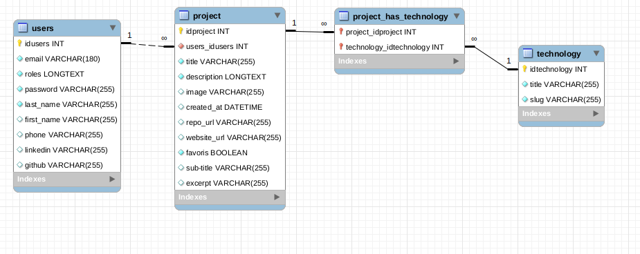
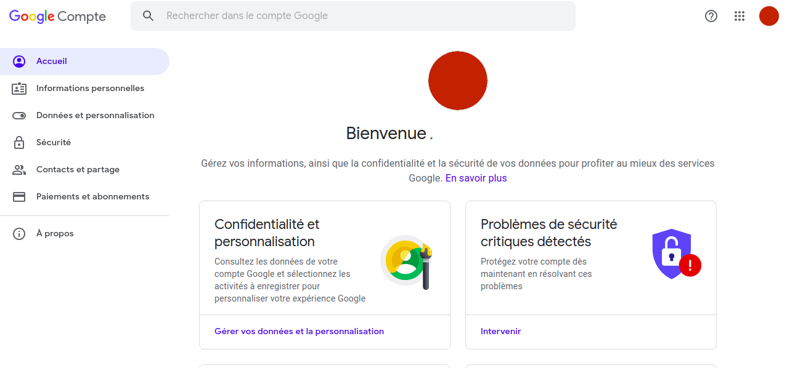
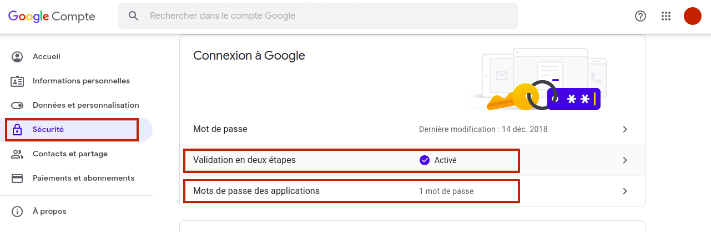
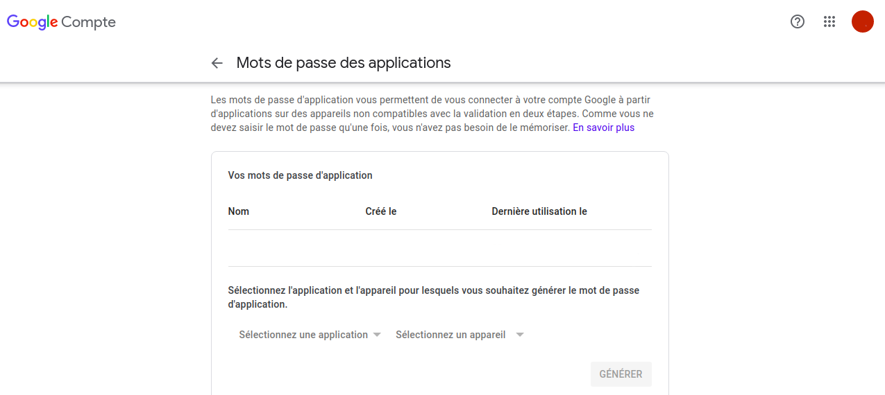
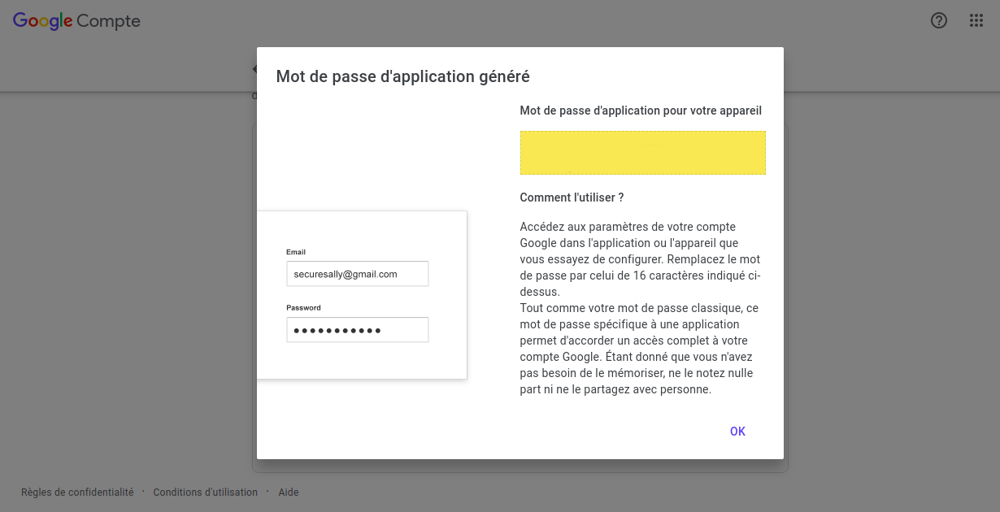

# Documentation du projet MYP (Make Your Portfolio)

Un excellent moyen de se familiariser avec MYP est de suivre ce didacticiel, qui vous guide tout au long de la construction de votre propre portfolio. Nous décrivons ici toutes les informations et nous vous fournissons tous les détails dont vous avez besoin pour utiliser MYP. L'application MYP que vous allez créer permet de mettre en place simplement un catalogue de vos projets de developpement et d'en afficher les détails.

## Sommaire

1. Introduction
2. Prérequis 
3. Installation
4. Démarrage 
6. Présentation du projet
    * Organisation du dossier
    * Modèle de base de données
7. Personnaliser le projet
    * Base de données
    * Mailing
    * Css
    * Templates
8. Hebergement

## Prérequis


Projet développer avec:

* [Django](https://www.djangoproject.com/) - Framework web Python
* [npm](https://www.npmjs.com/) - Gestionnaire de paquets Node.js
* [Pillow](https://pillow.readthedocs.io/en/stable/) - Librairie de traitement d'image Python
* [Webpack](https://webpack.js.org/) - Module bundler Javascript


## Installation


Les étapes pour installer le projet.

Après avoir cloner le projet avec ``git clone https://github.com/Abdellah-Sk/myp-django.git``.

Executez la commande ``cd myp-django`` pour vous rendre dans le dossier depuis le terminal.

Ensuite taper la commande ``source venv/bin/activate`` pour activer l'environnement virtuel.

Puis ``cd src`` pour vous rendre dans le dossier de developpement.

Enfin lancer l'application grâce a la commande suite : ``python manage.py runserver``.


## Démarrage


Une fois sur l'application, il ne vous reste plus qu'a vous connecter au back-office en ajouter dans l'URL ``/admin``.

Nom d’utilisateur :  ``admin``

Mot de Passe: ``admin`` 


## Présentation du projet

Cette section contient les différentes options générales du projet.

### Organisation du dossier

Dans cette partie, nous allons vous presentez la structure du projet MYP en Django.
Après avoir pull le projet, vous allez avoir une arborescence qui va ressembler ça ceci :

```
├── img
│   └── projet1.png
├── db.sqlite3
├── manage.py
├── projects
│   ├── admin.py
│   ├── forms.py
│   ├── __init__.py
│   ├── models.py
│   ├── static
│   │   ├── projects
│   │   │   ├── style.css
│   │   │   ├── index.js
│   │   │   └── img
│   ├── templates
│   │   └── projects
│   │       └── index.html
│   ├── tests.py
│   └── views.py
└── PortfolioDjango
    ├── settings.py
    ├── urls.py
    └── wsgi.py
```

A la racine:
* __img__ : Dossier d'upload des images des projets
* __db.sqlite3__ : Fichier de base de données sqlite

Le dossier d'application :
* __projects__ : Répertoire de l'application Django
* __static__ : Dossier contenant les fichiers statique (css, javascript, images)
* __templates__ : Dossier contenant les differents template liés au projet
* __views__ : Fichier contenant les fontions de vues
* __models__ : Fichier contenant les champs et le comportement essentiels des données

Le dossier du projet :
* __PortfolioDjango__ : Correspond au paquet Python effectif de votre projet.
* __settings__ : Réglages et configuration du projet Django
* __urls__ : Les déclarations des URL de ce projet Django


### Modèle de base de données

La base donnée est composé de trois tables principal plus une table de relation ManyToMany.

On retrouve donc une table User, une table Projects, une table Technologies, et une table Projects_technologies qui fait office de relation ManyToMany entre les projets et les technologies.

Ci-dessous, le modèle de la base donnée :



## Personnaliser le projet

Si vous prévoyez des personnalisations de code, cette section est faite pour vous. Elle vous permet d'appliquer des modifications à votre site.

### Base de données

Pour ce qui concerne la base de données, nous avons le choix d'utilisé Sqlite 3 pour le projet en Django. Cependant, pour toute modification de la base de données, rendez vous dans le fichier: ```settings.py```.

Depuis le code, vous avez la possibilité de modifié votre base de données. Pour d'eventuel problematique, je vous redigire directement sur la documentation de Django : https://docs.djangoproject.com/en/3.1/ref/settings/#databases


```
DATABASES = {
    'default': {
        'ENGINE': 'django.db.backends.sqlite3',
        'NAME': BASE_DIR / 'db.sqlite3',
    }
}
```

### Mailing

L'envoi d'e-mails est l'une des parties importantes du site Web. Pour envoyer des e-mails à partir de votre site vous aurez besoin d'avoir un serveur hôte de courrier électronique et dans ce cas, nous allons utiliser le serveur SMTP google.

Pour que cela fonctionne, vous devez disposer d'un compte Gmail fonctionnel. Rendez vous ensuite dans vos parametres Gmail : __"Gérer votre compte Google"__. 



Cliquez maintenant sur l'onglet __"Sécurité"__. 

Assurez-vous d'activer la valisation en deux étapes. 

Cliquez maintenant sur __"Mots de passe des applications__. 



Après avoir taper de nouveau votre mot de passe, il ne vous reste plus qu'a cliquez sur "Sélectionnez une application". Choisissez __Autre (Nom personnalisé)__ et donnez un nom à votre application puis __Générer__. Gmail générera une clé ou un mot de passe d'application assurez-vous de copier cette clé ou de l'enregistrer dans un fichier texte.





Pour configurer votre moteur de messagerie, il vout faut modifier le fichier ```settings.py``` de votre application Django:

```
EMAIL_BACKEND = ‘django.core.mail.backends.smtp.EmailBackend’
EMAIL_HOST = ‘smtp.gmail.com’
EMAIL_USE_TLS = True
EMAIL_PORT = 587
EMAIL_HOST_USER = ‘votre_compte@gmail.com’
EMAIL_HOST_PASSWORD = ‘votre mot de passe d'application’
```

* __EMAIL_BACKEND__: Chemin d’importation Python vers la classe du moteur de messagerie.
* __EMAIL_HOST__ et __EMAIL_PORT__: Hôte et Port utilisés.
* __EMAIL_HOST_USER__ et __EMAIL_HOST_PASSWORD__: Paramètres d’authentification auprès du serveur SMTP.

Enfin pour une personnalisation plus poussé des e-mails, je vous invite a modifier la fonction __contact__ dans le fichier ```src/projects/views.py```.

Pour ce tutoriel, nous avons fais le choix d'utiliser Gmail cependant vous pouvez aussi utiliser SendGrid, Mailgun, Sendinblue, ou autres pour votre applications. Pour une exploration plus approfondie, je vous redigire vers la documentation Django a ce sujet : https://docs.djangoproject.com/en/1.11/topics/email/


### Css

### Templates

Pour toute modification des templates, vous devez vous rendre dans ```src/projects/templates```